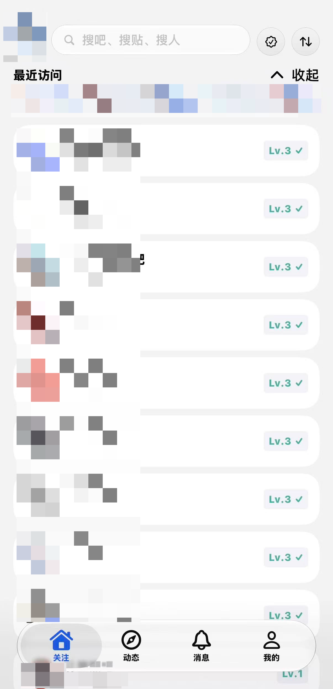
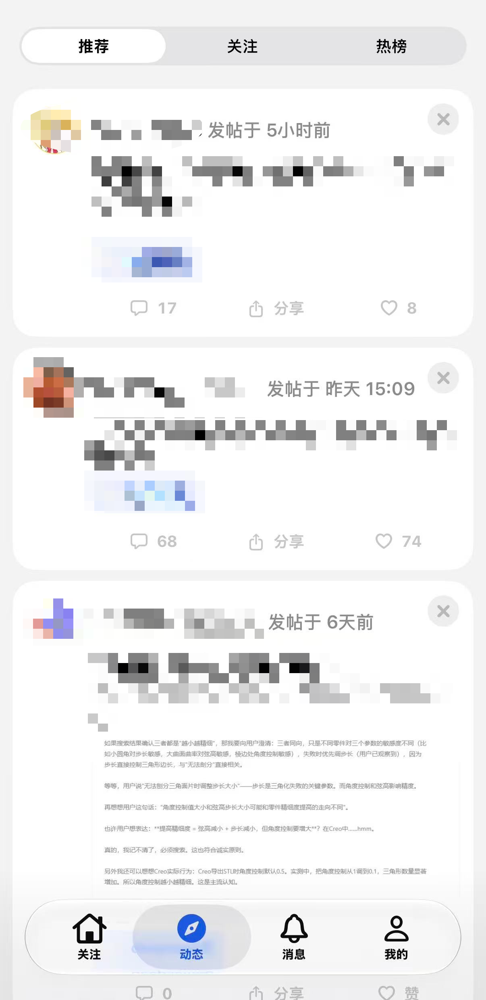
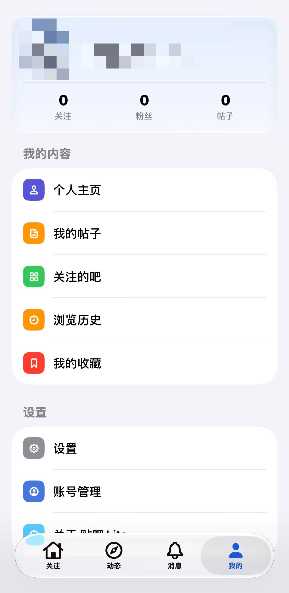
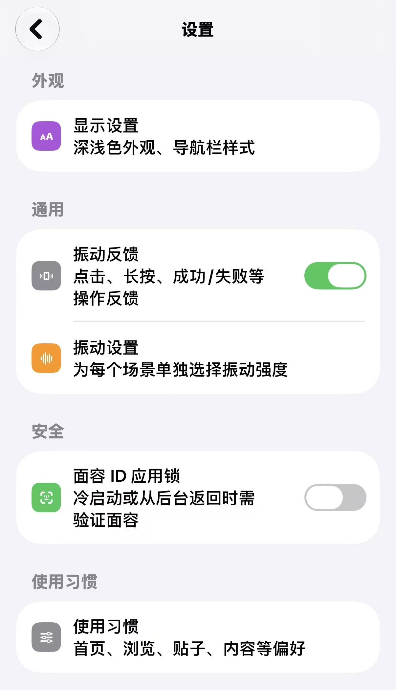

<div align="center">

# 贴吧 Lite · TiebaLite for iOS

**第三方百度贴吧 iOS 客户端** — Expo 57 (React Native 0.86) + Swift 原生模块混合开发，iOS 26 液态玻璃风格

[](https://github.com/toamdou/TiebaLite-RN-Swift/actions/workflows/build-ipa.yml)


<!-- ═══════════ 真机演示图 ═══════════
     截图放 docs/screenshots/，覆盖同名文件即可更新：
     home.png（关注页）/ explore.png（动态页）/ profile.png（我的页）/ settings.jpg（设置页） -->





</div>

---

## ✨ 功能一览

### ✅ 已实现

**浏览**

- ✅ 关注页：关注吧列表、最近访问、关注吧动态
- ✅ 动态页：推荐 / 关注 / 热榜
- ✅ 吧页：分类浏览、排序、吧资料、单吧签到、关注 / 取关
- ✅ 帖子页：楼层列表、楼中楼（子回复）、父回复引用、楼层排序
- ✅ 搜索：吧 / 帖 / 人
- ❓ 消息中心：回复我的 / 提到我的（未经测试，可能存在Bug）
- ✅ 用户主页：资料与发帖浏览
- ✅ 历史记录与收藏夹

**互动**

- ✅ 登录：百度通行证 WebView 授权
- ✅ 点赞 / 取消点赞（帖子、楼层）
- ✅ 收藏 / 取消收藏帖子
- ✅ 一键签到：批量吧签到 + 灵动岛 Live Activity 实时进度

**体验**

- ✅ 深色模式（含 AMOLED 纯黑）
- ✅ 液态玻璃顶栏 / 底栏与原生转场（iOS 26+）
- ✅ 触感反馈
- ✅ 图片查看器
- ✅ 视频播放
- ✅ 广告 / 直播内容过滤
- ❓ 屏蔽：屏蔽词 / 屏蔽用户 / 屏蔽吧
- ✅ 阅读字号、省流量模式、图片加载质量三档
-❓  App scheme 深链

### ❌ 未实现

- ❌ 发帖 / 回复 / 楼中楼发言 —— 只读 + 轻互动，无法发言
- ❌ 私信
- ❌ 推送通知（应用不带推送权限）
- ❌ 直播观看（信息流中已过滤）
- ❌ 投票等帖子内互动插件
- ❌ iPad 适配（仅 iPhone 竖屏）

## 🛠 本地编译

### 环境要求

| 依赖 | 要求 |
| --- | --- |
| macOS | 14+ |
| Xcode | 26 或更高（开发环境为 Xcode 27 beta） |
| Node.js | 20+（推荐 22 LTS） |
| CocoaPods | 1.15+ |
| Apple ID | 免费个人 Apple ID 即可真机调试 |

### 步骤

```bash
git clone https://github.com/toamdou/TiebaLite-RN-Swift.git
cd TiebaLite-RN-Swift

npm install              # 安装 JS 依赖

npm run pods:source      # 源码方式安装 Pods（首次约 10–30 分钟）

open ios/tiebalite.xcworkspace
```

在 Xcode 中：

1. 选中 `tiebalite` target → **Signing & Capabilities** → 勾选你自己的 Team（免费个人 Apple ID 即可）；
2. 若 Bundle Identifier `com.tiebalite.app` 与你的签名冲突，改成自己的（如 `com.yourname.tiebalite`）；
3. 选择你的 iPhone 真机 → **⌘R** 编译运行。

日常开发也可以使用仓库自带脚本：

```bash
npm run ios:build        # = RCT_USE_RN_DEP=0 RCT_USE_PREBUILT_RNCORE=0 expo run:ios，自动起 Metro
npm start                # 纯 JS 改动的热更新模式（配合已装好的 App）
```

## 🤖 GitHub Actions 自动打包（未签名 IPA）

仓库自带工作流 [`.github/workflows/build-ipa.yml`](.github/workflows/build-ipa.yml)：在 GitHub 的 macOS runner 上完成 npm 依赖 → Pods → `xcodebuild archive`（禁用签名）→ 打包 `.ipa`。

**两种触发方式：**

1. **手动构建**：仓库页 → **Actions** → **Build iOS Unsigned IPA** → **Run workflow**（可选 Release / Debug）→ 结束后在本次运行页面的 Artifacts 下载 `TiebaLite-unsigned-*.ipa`；
2. **打 Tag 自动发 Release**：

   ```bash
   git tag v1.0.0
   git push origin v1.0.0
   ```
## 📱 通过 SideStore / AltStore 安装

CI 产出的是**未签名 IPA**，不能直接安装，需要 SideStore / AltStore 用你自己的 Apple ID 重签后侧载：

免费 Apple ID 的限制：签名 **7 天有效**（SideStore 可自动刷新）、最多同时签 **3 个 App**、部分能力（推送 / App Groups 等）不可用。

## 🙏 致谢

本项目站在这些项目的肩膀上：

- [HuanCheng65/TiebaLite](https://github.com/HuanCheng65/TiebaLite) — Kotlin 原版（真正原创），API 协议与交互设计的主要参照
- [zzc10086/TiebaLite](https://github.com/zzc10086/TiebaLite) — Kotlin 版 fork，接口实现的直接对照来源
- [Starry-OvO/aiotieba](https://github.com/Starry-OvO/aiotieba) — 贴吧协议字段参考
- [n0099/tbclient.protobuf](https://github.com/n0099/tbclient.protobuf) — 百度贴吧客户端 protobuf 定义合集

## 📄 许可证

本项目以 [GPL-3.0](LICENSE) 协议开源。

## ⚠️ 免责声明

本软件及源码**仅供学习交流使用，严禁用于商业用途**。本项目与百度官方无关，贴吧相关 API 与数据版权归百度所有，使用本项目产生的一切后果由使用者自行承担。
